# CKC (CKCs-Kernel-Compiler)


Our course project for Compiler Principle at ZJU.

## Environment

- Operating System

  Ubuntu 22.04 LTS

- Compilation Environment

  - Flex 2.6.4
  - Bison 3.8.2
  - gcc/g++

- Auxiliary Open Source Code Framework

  LLVM 14.0.0

## File Structure

- `bison/`: Flex/Yacc source code
  - `lexer.l`: directory of Lex source code, realize syntax analysis and generate abstract syntax tree
- `include/`: header file directory
  - `AbstractSyntasTree.h`: define the wrapper class of the abstract syntax tree
  - `SemanticAnalyzer.h`: define semantic analyzer
  - `CodeGenerator.h`: define the generator used to generate intermediate code and object code
  - `SymbolTable.h`: define the symbol table data structure used in semantic analysis
  - `common.h`: contain
  - `Utility.h`: contains namespaces and tool functions related to type checking
  - `Node.h`: header files related to syntax tree nodes, including base class nodes `ASTNode` and various derived class nodes
  - `y.tab.h`: header file generated by compilation of parser.y
- `src/`: file directory of source code
- `main.cpp`: the file where the main function is located, mainly responsible for calling lexical analyzer, parser, and code generator
- `test/`: directory of test case files
  - `typetest`: built-in type test
  - `computertest`: calculation test
  - `ctrlflowtest`: control flow test
  - `funtest`: function test
  - `multipletest`: comprehensive test
    - `AST.txt`: output of syntax tree
    - `IR.txt`: output of intermediate code
    - `ASM.txt`: output of target assembly code
- `ckc.sh`: CKC source code compilation script
- `ckc`: executable of CKCcompiler
- `cc.o`: object code file generated by CKC compilation
- `cc`: executable file generated by object code through gcc/g++ compiler

## Test Case

### Data Type Test

- ###### Test Code

  ```c++
  int a ;
  float b = 2.34;
  bool c = true;
  
  int main()
  {
  	puti(++a);
  	a = b;
  	puti(a);
  	a = c;
  	puti(a);
  }
  ```

- ###### AST

  ```c++
  [Root] Translation Unit Starts Here!
  | [EXTERNAL DEFINITION]
  +-------Declaration
  | | [TYPE]
  | +-------INTEGER
  | | [SYMBOLS]
  | +-------Declared Symbols
  | | | [NAME]
  | | +-------[ID] a
  | [EXTERNAL DEFINITION]
  +-------Declaration
  | | [TYPE]
  | +-------FLOAT
  | | [SYMBOLS]
  | +-------Declared Symbols
  | | | [NAME]
  | | +-------[ID] b
  | | | [INIT VALUE]
  | | +-------[float] 2.340000
  | [EXTERNAL DEFINITION]
  +-------Declaration
  | | [TYPE]
  | +-------BOOLEAN
  | | [SYMBOLS]
  | +-------Declared Symbols
  | | | [NAME]
  | | +-------[ID] c
  | | | [INIT VALUE]
  | | +-------[bool] true
  | [EXTERNAL DEFINITION]
  +-------Function Definition
  | | [RETURN TYPE]
  | +-------INTEGER
  | | [NAME]
  | +-------[ID] main
  | | [PARAMS]
  | +-------Parameter List
  | | [BODY]
  | +-------Compound Statement
  | | | [ITEM]
  | | +-------Expression Statement
  | | | | [EXPR]
  | | | +-------Puti Call
  | | | | | [ARG EXPR]
  | | | | +-------Assign Expression
  | | | | | | [LEFT]
  | | | | | +-------[ID] a
  | | | | | | [RIGHT]
  | | | | | +-------ADD(INTEGER)
  | | | | | | | [LEFT]
  | | | | | | +-------[ID] a
  | | | | | | | [RIGHT]
  | | | | | | +-------[int] 1
  | | | [ITEM]
  | | +-------Expression Statement
  | | | | [EXPR]
  | | | +-------Assign Expression
  | | | | | [LEFT]
  | | | | +-------[ID] a
  | | | | | [RIGHT]
  | | | | +-------[ID] b
  | | | [ITEM]
  | | +-------Expression Statement
  | | | | [EXPR]
  | | | +-------Puti Call
  | | | | | [ARG EXPR]
  | | | | +-------[ID] a
  | | | [ITEM]
  | | +-------Expression Statement
  | | | | [EXPR]
  | | | +-------Assign Expression
  | | | | | [LEFT]
  | | | | +-------[ID] a
  | | | | | [RIGHT]
  | | | | +-------[ID] c
  | | | [ITEM]
  | | +-------Expression Statement
  | | | | [EXPR]
  | | | +-------Puti Call
  | | | | | [ARG EXPR]
  | | | | +-------[ID] a
  ```

- ###### IR

  ```c++
  ; ModuleID = 'CKC IR Code'
  source_filename = "CKC IR Code"
  
  @a = global i32 0
  @b = global double 0.000000e+00
  @c = global i1 false
  @.str = constant [16 x i8] c"Put Value = %d\0A\00"
  @.str.1 = constant [16 x i8] c"Put Value = %d\0A\00"
  @.str.2 = constant [16 x i8] c"Put Value = %d\0A\00"
  
  declare void @printf(i32)
  define internal void @GlobalInit() {
  	store double 0x4002B851E0000000, double* @b, align 8
  	store i1 true, i1* @c, align 1
  	ret void
  }
  define i32 @main() {
  	call void @GlobalInit()
  	%loadtmp = load i32, i32* @a, align 4
  	%iaddtmp = add i32 %loadtmp, 1
  	store i32 %iaddtmp, i32* @a, align 4
  	%puti = call void @printf(i8* getelementptr inbounds ([16 x i8], [16 x i8]*
  	@.str, i64 0, i64 0), i32 %iaddtmp)
  	%loadtmp1 = load double, double* @b, align 8
  	%icasttmp = fptosi double %loadtmp1 to i32
  	store i32 %icasttmp, i32* @a, align 4
  	%puti3 = call void @printf(i8* getelementptr inbounds ([16 x i8], [16 x i8]*
  	@.str, i64 0, i64 0), i32 %icasttmp)
  	%loadtmp4 = load i1, i1* @c, align 1
  	%icasttmp5 = zext i1 %loadtmp4 to i32
  	store i32 %icasttmp5, i32* @a, align 4
  	%puti7 = call void @printf(i8* getelementptr inbounds ([16 x i8], [16 x i8]*
  	@.str, i64 0, i64 0), i32 %icasttmp5)
  	ret void
  }
  ```

- ###### Assembly Instruction

  ```assembly
  cc.o: file format elf64-x86-64
  Disassembly of section .text:
  0000000000000000 <GlobalInit>:
  0: 48 8b 05 00 00 00 00 mov 0x0(%rip),%rax # 7
  <GlobalInit+0x7>
  7: 48 b9 00 00 00 e0 51 movabs $0x4002b851e0000000,%rcx
  e: b8 02 40
  11: 48 89 08 mov %rcx,(%rax)
  14: 48 8b 05 00 00 00 00 mov 0x0(%rip),%rax # 1b
  <GlobalInit+0x1b>
  1b: c6 00 01 movb $0x1,(%rax)
  1e: c3 ret
  1f: 90 nop
  0000000000000020 <main>:
  20: 41 56 push %r14
  22: 53 push %rbx
  23: 50 push %rax
  24: e8 d7 ff ff ff call 0 <GlobalInit>
  29: 48 8b 1d 00 00 00 00 mov 0x0(%rip),%rbx # 30 <main+0x10>
  30: 8b 33 mov (%rbx),%esi
  32: 83 c6 01 add $0x1,%esi
  35: 89 33 mov %esi,(%rbx)
  37: 4c 8b 35 00 00 00 00 mov 0x0(%rip),%r14 # 3e <main+0x1e>
  3e: 4c 89 f7 mov %r14,%rdi
  41: e8 00 00 00 00 call 46 <main+0x26>
  46: 48 8b 05 00 00 00 00 mov 0x0(%rip),%rax # 4d <main+0x2d>
  4d: f2 0f 2c 30 cvttsd2si (%rax),%esi
  51: 89 33 mov %esi,(%rbx)
  53: 4c 89 f7 mov %r14,%rdi
  56: e8 00 00 00 00 call 5b <main+0x3b>
  5b: 48 8b 05 00 00 00 00 mov 0x0(%rip),%rax # 62 <main+0x42>
  62: 0f b6 30 movzbl (%rax),%esi
  65: 89 33 mov %esi,(%rbx)
  67: 4c 89 f7 mov %r14,%rdi
  6a: e8 00 00 00 00 call 6f <main+0x4f>
  6f: 48 83 c4 08 add $0x8,%rsp
  73: 5b pop %rbx
  74: 41 5e pop %r14
  76: c3 ret
  ```

- ###### Running Results

  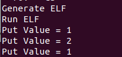

### Compute Test

- ###### Test Code

  ```c++
  int a=15,b=255,c=1234;
  int main()
  {
  	puti(++a);
  	puti(--a);
  	puti(!a);
  	puti(+a);
  	puti(-a);
  	puti(a<<1);
  	puti(a>>1);
  	puti(a>=10);
  	puti(a<=15);
  	puti(a==16);
  	puti(a & b);
  	puti(a ^ b);
  	puti(a | b);
  	puti(a && b);
  	puti(a || b);
  	puti(a = b);
  	puti(b % a);
  	puti(a , b);
  	puti(a ? b : c);
  }
  ```

- ###### Intermediate Output

  test/computetest.txt

- ###### Running Results

  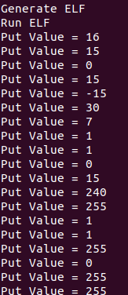

### Control Flow Test

#### Branch Test -- If-else

- ###### Test Code

  ```c++
  int main()
  {
  	int x = 10;
  	if (x)
  	{
  		++x;
  	}
  	else
  	{
  		--x;
  	};
  	puti(x);
  	return 0;
  }
  ```

- ###### Intermediate Output

  test/iftest.txt

- ###### Running Results

  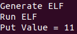

#### Loop Test -- While

- ###### Test Code

  ```c++
  int main()
  {
  	int a =10;
  	while(--a)
  	{
  		puti(a);
  	}
  	return 0;
  }
  ```

- ###### Intermediate Output

  test/whiletest.txt

- ###### Running Results

  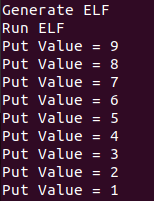

#### Loop Test -- Do-while

- ###### Test Code

  ```c++
  int main()
  {
  	int a = 10;
  	do
  	{
  		--a;
  		puti(a);
  	}
  	while(a);
  	return 0;
  }
  ```

- ###### Intermediate Output

  test/dwtest.txt

- ###### Running Results

  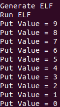

#### Loop Test -- For

- ###### Test Code

  ```c++
  int main()
  {
  	int a = 101;
  	for(;a;a /= 10) {
  		puti(a);
  	}
  }
  ```

- ###### Intermediate Output

  test/fortest.txt

- ###### Running Results

  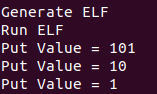

### Function Test

#### Normal Function Test

- ###### Test Code

```c++
int f(int x)
{
	int a = 10;
	int b = x;
	x = ++a + b;
	return x;
}
int main()
{
	int a = f(1);
	int b = f(a);
	puti(f(a + b));
}
```

- ###### Intermediate Output

  test/tsfuntest.txt

- ###### Running Results

  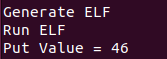

#### Recursive Function Test

- ###### Test Code

```c++
int fibb(int n)
{
	if(n!= 1 && n!= 2) return fibb(n-1) + fibb(n-2);
	else return 1;
}
int main()
{
	puti(fibb(10));
}
```

- ###### Intermediate Output

  test/fibfuntest.txt

- ###### Running Results

  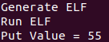

### Comprehensive Test

#### Test Case 1

- ###### Test Code

```c++
float g = 5;
int foo(int x) { return x*x; }
void bar(int a) {
	int b = foo(a);
	g += b;
}
int main() {
	bar(2);
	puti(g);
}
```

- ###### Intermediate Output

  test/easy.txt

- ###### Running Results

  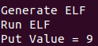

#### Test Case 2

- ###### Test Code

```c++
int i1 = -2;
float i2 = +0.5;
int i3 = 3.00+i1+i2;
bool foo(int x) { return x==1; }
bool a;
int bar(float y) {
	int a = y + foo(y);
	return foo(a);
}
int main() {
	puti (bar(1.0) + bar(0.25));
}
```

- ###### Intermediate Output

  test/medium.txt

- ###### Running Results

  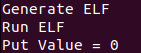

#### Test Case 3

- ###### Test Code

```c++
int a;
int b;
int c;
float f = 6.247;
int foo(int b, float c) {
	int x = b*b;
	a = b + c;
	return a;
}
int bar(){
	for(int i = 0; i < 10; i += 1) {
		if(i < 5) a *= b/c;
		else if ( i < 8 ) {
			a ^= b&c;
		}
		while( --a > 0 );
		for(; false; a <<= 1) {
			a -= foo(a, b-c);
			continue;
		}
	}
	return a+b+c;
}
int main() {
	c=2;
	puti(foo(bar(), foo(-2, bar())));
}
```

- ###### Intermediate Output

  test/hard.txt

- ###### Running Results

  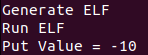

## [Document in Chinese](https://github.com/haoyi-duan/CKCs-Kernel-Compiler/blob/master/report_15.pdf)

